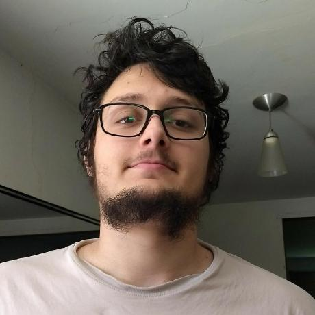
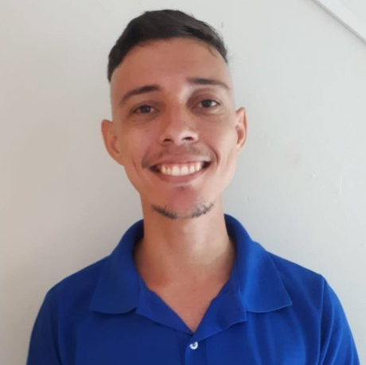
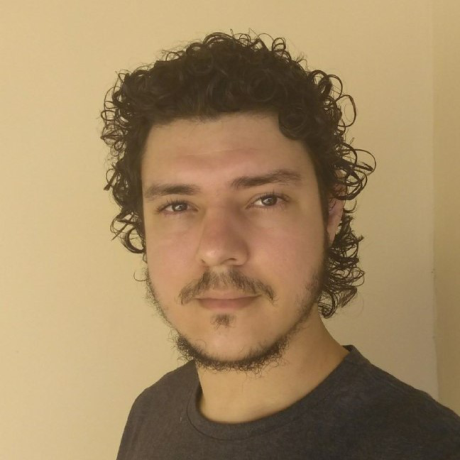

# Documentação referente a solução produzido pelo Time16 para o 2° Hackathon CCR 
## Sobre a solução Emprega ai
Durante o Hackathon desenvolvemos uma solução que visa trazer oportunidades de emprego e estagio para estudantes de ensino médio e universitários com alguma vulnerabilidade social. Como medida de melhorar a combinatória de currículos para vagas incluímos as pretensões tanto para com os candidatos para quanto o que os entrevistadores esperam das vagas.

### Responsabilidade social
#### Feedback ao usuário
Como meio de trazer melhorias sociais e intelectuais criamos a possibilidade de o entrevistador retornar um feedback ao candidato não escolhido, para que o mesmo dentro do possível possa trabalhar nos aspectos que lhe faltaram para a vaga. Essa avaliação não é compulsória, porem os dados de currículos avaliados geram avaliação da empresa.

#### Auxilo ao primeiro emprego
Para reduzir a disparidade social a nossa plataforma contamos com um blog que possuirá conteúdos que auxiliem as pessoas a realizarem os primeiros passos para entrarem no mercado de trabalho.

## Mapas de empatia

Para melhor avaliação da nossa proposta criamos 2 mapas de Empatia para avaliar os pontos do nosso sistema, sendo um para o Estudante e o outro apresentando a visão da empresa. 

##### Estudante: 

-----
##### Empresa: 

## Lean Canvas

[Lean canvas](/Mapas%20de%20empatia/leancanvas1.pdf)
## Roadmap

Para o desenvolvimento da solução dividimos o desenvolvimento em duas etapas, sendo a primeira a ser executada durante o Hackathon e a segunda após o termino devido o tamanho da solução.
#### Etapa 1: 

Conteúdo produzido durante o Hackathon 

- [x] API para Cadastro de Aluno, Empresa e blog.
- [x] Pagina de Cadastro de Aluno
- [x] Pagina de cadastro de dados da Empresa
- [x] Pagina de seleção de candidato da Empresa *
- [ ] Pagina de Empresas interessadas num Aluno
- [ ] Pagina do Blog de auxilio ao primeiro emprego

<h6>* Seleção de candidatos até o momento sera feita com o avaliador selecionando os filtros que correspondem o currículo e pretensões necessárias a vaga. Esta solução foi escolhida para contemplar o tempo do evento e sera alterada na segunda etapa.</h6>
#### Etapa 2: 

Conteúdo a ser produzido após o termino do Hackathon

- [ ] Possibilidade da empresa publicar vagas  
- [ ] Seleção de candidatos por vagas de acordo com seu currículo e pretensões
- [ ] Avaliação das empresas de acordo com o feedback retornado aos 
- [ ] Adicionar Login e autenticação
- [ ] Possibilidade de inclusão de foto para participante
- [ ] Possibilidade de inclusão de certificados ao participante
- [ ] Avaliação psicológica do perfil comportamental dos usuários
  
### Repositórios 
No desenvolvimento dessa solução dividimos em 3 repositórios sendo um repositório para a API, um repositório para o frontend e um repositório para a documentação produzida no evento. Os links se encontram abaixo:

[API](https://github.com/GianMantuan/hackathon-ccr-api) | [FrontEnd](https://github.com/GianMantuan/hackathon-ccr-mobile) | [Documentação](https://github.com/GianMantuan/hackathon-ccr-documentation)

### Tecnologias utilizadas
Backend foi desenvolvido com Express e Typescript com banco de dados não relacional mongoDb, FrontEnd foi desenvolvido em ReactNative.

### Nossa equipe

     

<h6> Gian Carlo Mantuan Dala Rosa </h6> 

Formado em Analise e desenvolvimento de sistemas
com experiencia na area de programação.

[GianMantuan](https://github.com/GianMantuan)

<giancarlo.mdr@gmail.com>

    

<h6> Ricardo Fedrigo </h6> 

Estudante de Ciência da Computação
programador com experiencia em desenvolvimento.
Formado em em técnico em eletrotécnica   

[RicardoFedrigo](https://github.com/RicardoFedrigo)

<ricardofedrigo1995@gmail.com>

    

<h6> Andre Lucas Monegat Costa </h6> 
 
Estudante de Ciência da Computação
com experiencia na área de CAD
programação e projeto.
    
[Monegat](https://github.com/Monegat)

<andre@monegat.com.br>

    

<h6> Calebe de Carvalho Luz</h6> 

Estudante de engenharia de software

[CalebedcLuz](https://github.com/CalebedcLuz)

<calebedcluz@gmail.com>

    

<h6> Ezequiel de Carvalho Luz</h6> 

Estudante de Engenharia Eletrônica
Experiências na áreas Mecânicas
Eletrônicas, CAD e Design.

[EzequielCLuz](https://github.com/EzequielCLuz  )

<ezequielcluz@gmail.com>

    

<h6> Paulo Roberto Vieira</h6> 

Estudante de Ciência da Computação.
Consultor em engenharia de segurança da informação.
Administrador de redes e sistemas operacionais.
Programador com foco a ferramentas de redes.
Ex-bolsista de pesquisa e extensão em Filosofia direcionada a área de Epistemologia

[scrolll0ck](https://github.com/scrolll0ck)

<pvieira@alunos.utfpr.edu.br>
### Agradecimentos

Gostaríamos de agradecer aos mentores que agiram de forma essencial para o desenvolvimento desse projeto, dentre eles estão: 

<h6> Fabio Portela Rodrigues
<h6> Fabio Schmid
<h6> Rodrigo Bravim Roque
<h6> Maria Cristina dos Santos

